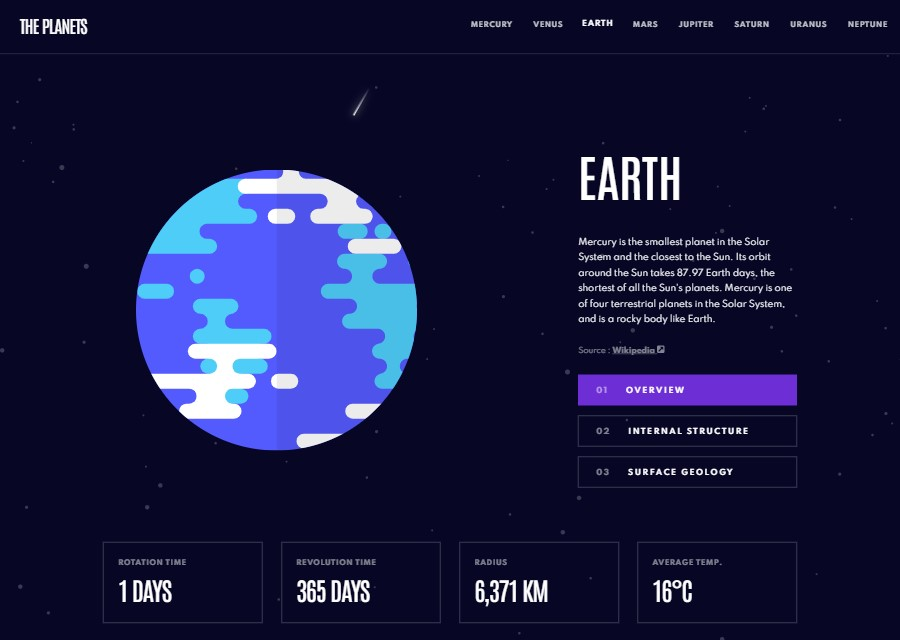

# Frontend Mentor - Planets fact site solution

This is a solution to the [Planets fact site challenge on Frontend Mentor](https://www.frontendmentor.io/challenges/planets-fact-site-gazqN8w_f). Frontend Mentor challenges help you improve your coding skills by building realistic projects.

## Table of contents

- [Overview](#overview)
  - [The challenge](#the-challenge)
  - [Screenshot](#screenshot)
  - [Links](#links)
- [My process](#my-process)
  - [Built with](#built-with)
  - [What I learned](#what-i-learned)
  - [Continued development](#continued-development)
  - [Useful resources](#useful-resources)
- [Author](#author)
- [Acknowledgments](#acknowledgments)

## Overview

### The challenge

Users should be able to:

- View the optimal layout for the app depending on their device's screen size
- See hover states for all interactive elements on the page
- View each planet page and toggle between "Overview", "Internal Structure", and "Surface Geology"

### Screenshot




### Links

- Solution URL: [https://github.com/seanred360/planets-fact-site]
- Live Site URL: [https://planets-fact-site-mu.vercel.app/]

## My process

### Built with

- SASS/SCSS
- Animejs
- Flexbox
- CSS Grid
- Mobile-first workflow

### What I learned

This was my first time using Anime.js. The documentation was extremely well written and interesting to read. I spent a lot of time playing with different animations. I am proud of myself for being able to read someone else's code and reverse engineer it by myself. I recreated Sharna Hossain's "React Twinkling Stars Anime.js" in vanilla Javascript. At the time of writing, I had no experience using React. Original code found here [https://codepen.io/sharnajh/pen/WNvppRy?editors=0110]

```js
// Create a shooting star div and give it random x y coordinates and a random radius.
function createWish(quantity) {
  randomRadius = () => {
    return Math.random() * 0.7 + 0.6;
  };
  getRandomX = () => {
    return Math.floor(Math.random() * Math.floor(window.innerWidth)).toString();
  };
  getRandomY = () => {
    return Math.floor(
      Math.random() * Math.floor(window.innerHeight)
    ).toString();
  };

  for (let i = 0; i < quantity; i++) {
    const wish = document.createElement("div");
    wish.classList.add("wish");
    wish.style.left = `${this.getRandomY()}px`;
    wish.style.top = `${this.getRandomX()}px`;
    shootingstars.appendChild(wish);
  }
}

// Create the number of shooting stars we think looks good.
createWish(60);

// Finally animate the shooting stars with Anime.js
anime({
  targets: [".wish"],
  easing: "linear",
  loop: true,
  delay: (el, i) => 1000 * i,
  opacity: [
    {
      duration: 100,
      value: "1",
    },
  ],
  width: [
    {
      value: "150px",
    },
    {
      value: "0px",
    },
  ],
  translateX: 350,
});
```

### Continued development

In the future I would like to add swipe gestures for mobile and keyboard functionality to improve accessability. I would like to make some custom planet SVG files and animate them with Anime.js to look like they are rotating in 3D. The goal was to match the Figma design I was given as much as possible. I want to improve upon the Figma file's design and make the content fit without scrolling on more devices.

### Useful resources

- [https://glennmccomb.com/articles/useful-sass-scss-media-query-mixins-for-bootstrap/] - I found SASS was extremely useful for this project. Being able to better orangize my CSS by sections made it easier to find things in my code. Having mixins and helper classes made my code a lot more reusable, therefore saving time. For example, I used grid and flexbox very often, so I made a helper class for them. I found Glenn McComb's media query mixins extremely useful and I will be using them for other projects going forward.

```scss
$breakpoints: (
  xs: 610px,
  sm: 768px,
  md: 1024px,
  lg: 1400px,
);

@mixin respond-above($breakpoint) {
  // If the breakpoint exists in the map.
  @if map-has-key($breakpoints, $breakpoint) {
    // Get the breakpoint value.
    $breakpoint-value: map-get($breakpoints, $breakpoint);

    // Write the media query.
    @media (min-width: $breakpoint-value) {
      @content;
    }

    // If the breakpoint doesn't exist in the map.
  } @else {
    // Log a warning.
    @warn 'Invalid breakpoint: #{$breakpoint}.';
  }
}
```

- [https://tobiasahlin.com/moving-letters/#7] - Tobias Sahlin has many text animations made with Anime.js I will for sure use some of these on other projects. I modified his code so that it could be reused with any text.

```html
<h1 class="planet__title">
  <span class="animText-wrapper">
    <span class="change-planet animLetters">Mercury</span>
  </span>
</h1>
```

```js
function standupLettersAnim(textWrapper, targetClass) {
  // targetClass parameter must NOT have a period first
  // Wrap every letter in a span
  textWrapper.innerHTML = textWrapper.textContent.replace(
    /\S/g,
    `<span class="${targetClass}">$&</span>`
  );
  anime({
    targets: `.${targetClass}`,
    translateY: ["1.1em", 0],
    translateX: ["0.55em", 0],
    translateZ: 0,
    rotateZ: [180, 0],
    duration: 750,
    easing: "easeOutExpo",
    delay: (el, i) => 50 * i,
  });
}

standupLettersAnim(standupTextWrapper, "animLetter");
```

## Author

- Website - [Sean Redmon](https://github.com/seanred360)
- Frontend Mentor - [@seanred360](https://www.frontendmentor.io/profile/seanred360)
- Email - [seen360@yahoo.com](seen360@yahoo.com)

## Acknowledgments

- [https://www.youtube.com/channel/UCzNf0liwUzMN6_pixbQlMhQ] - Thanks to Coder Coder for her very useful tutorials.
- [https://www.youtube.com/user/KepowOb] - Thanks to Kevin Powell for his passionate videos about CSS properties.
